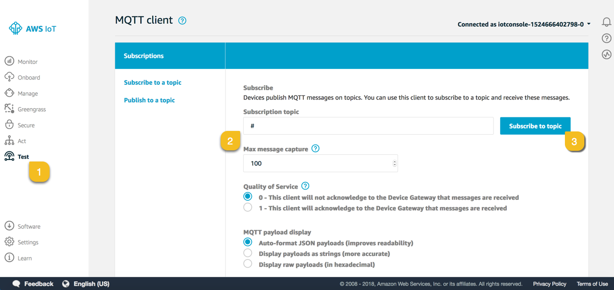

# IoT Automotive Immersion Day Labs

This hands-on lab will guide you through a series of steps to showcase
how AWS services fit into the context of Automotive. The labs will help
you to understand device connectivity, data generation, real-time
notification, and the analysis of the generated data.

## Prerequisites

You will need an active AWS account to setup these resources. Note that
launching the AWS CloudFormation script will result in costs for the
underlying instance used.

**Note**: This workshop reuses the setup of the AWS IoT Workshop.

## Amazon EC2 Instance Setup

### Step 1 - Launch the AWS CloudFormation Template

This AWS CloudFormation template creates an Amazon EC2 instance. Click
**Deploy to AWS** to get started. The CloudFormation template allows you
to use your default VPC or create a new one. The IAM roles used during
the workshop are created for you.

Right-click the appropriate link and choose **Open Link in New Tab**.

[<span class="underline">Deploy to
AWS</span>](https://console.aws.amazon.com/cloudformation/home?region=us-east-1#/stacks/new?stackName=automotive-prep-workshop&templateURL=https://s3-us-west-2.amazonaws.com/iotworkshop/ec2-cf-fast.json)

This action opens a browser page with the CloudFormation template
selected. Click **Next** to start populating the required fields.

### Step 2 - Configure the Stack

If you’re using a shared account make sure that you’re using a different
prefix for each launched workshop. All resources created will use this
prefix.

Enter a name and prefix for your workshop. If multiple participants are
using the same AWS account then add name/short name to the prefix for
both the Stack name and Workshop name. For example:

automotive-prep-workshop-\<*shortname*\>  
AWSWorkshop-\<*shortname*\>

otherwise, stack creation will fail. The same name will be used to
create Role, etc. so it must be unique.

Enter a username and password for accessing your C9 instance. Use a
strong password as this instance has SSH access via the browser.


On the next screen click **Next**.

On the final screen, review the settings, check the *acknowledgement at
the bottom of a summary page*, and then click **Create**. The process
will take five to seven minutes to complete, and then the **Output** tab
for the stack will provide a link to the **Workshop Website**.

### Step 3 - Accessing the Web Portal

After the CloudFormation is complete, you will have a public IP address
for your workshop. Click the link to access the portal and get started\!


**Note**: If you are redirected to a web page with a countdown, just
wait—your workshop is still building. This workshop uses a public IP
address. If you subsequently start this instance from the EC2 console,
you can find its public IP address on the EC2 instance page.


In some rare cases, you will only see an Apache welcome screen after
clicking on the portal link. If this happens, delete the CloudFormation
stack and try again.

### Step 5 – Install Connected Vehicle Solution and Simulator

The AWS IoT Device Simulator uses the Automotive module to generate trip
data using the Connected Vehicle Reference Architecture.

Deploy the Connected Vehicle Reference Architecture (CVRA):

**[INSTALL
TEMPLATE](https://console.aws.amazon.com/cloudformation/home?region=us-east-1#/stacks/new?templateURL=https:%2F%2Fs3.amazonaws.com%2Fsolutions-reference%2Fconnected-vehicle-solution%2Flatest%2Faws-connected-vehicle-solution.template)**

Deploy the AWS IoT Device Simulator: Use correct email address because
you will receive initial password on your email. It will take approx. 20
min to complete. After completion you will receive password and id in
email:

[**INSTALL
SIMULATOR**](https://s3.amazonaws.com/solutions-reference/iot-device-simulator/latest/iot-device-simulator.template)

**  
**

### Start with the Labs

Click the **Launch Cloud9** link to get started with detailed workshop
instructions.

Note: Ensure that you are not connected to a VPN or any restricted
network as these might prevent you from connecting to the Cloud9 IDE.
Also ensure security group allow access for port 3389.

The Cloud9 IDE will give you access to running scripts required for the
lab, uploading your certificates, executing console commands on your EC2
instance, and more. Use Cloud9 to run the scripts as directed in the
lab. Some steps that direct you to copy files to your server can be done
with Cloud9 by dragging and dropping the files into your workspace.

  - Cloud9 username: aws (or your changed username)

  - Cloud9 password: icebreaker (or your changed password)


# Lab 1: Connect Device to IoT Core

**Note**: All workshop examples are performed on your connected
device or your Amazon EC2 instance.

## Step 1 - Creating your First “Thing”, Security Policies, and Certificates

Let’s get your account set up with a new device, certificates, and
security policies.

Log into your AWS console and make sure that you are in the same region
you ran Cloud formation and access AWS IoT Core service. Click on
**onboard**. It should look similar to the following:


Let’s configure our first “device” and set up the policy and
certificates for this to work.

We’re going to select **“Configuring a device”** and click the Get
started button.

## Step 2 - Connect to AWS IoT

The **Connect to AWS IoT** screen will appear. Click the **Get
started** button to continue.


Next, we’re going to pick our target operating system and development
language. This is used to generate a full package for us to quickly
connect to AWS IoT.


For the hardware we’re working on today let’s pick Linux/OSX as our
platform and Python for our SDK.

You will now see the **Register a thing** screen.

## Step 3 – Register a Thing

To begin, click **Getting started** and enter a name for your new thing.
For these labs let’s call our new thing **tcu**. Enter this name and
click **Next step**.

Note: If you’re using a shared account, add your first name followed by
a hyphen to this name to make it unique, for example: \<*name*\>-tcu


On the next screen, you can see that everything has been generated for
you\!


So let’s see exactly what was generated:

  - You’ll notice a security policy has been created for you allowing
    you to immediately send and receive messages.

  - A **start.sh** script has been created. This script will download
    any additional files needed, including a sample application.

  - Finally, a Linux/OSX zip file containing all your certificates.

Make sure that you click the **Linux/OSX** link to download the
connection package.

**Note**: Do not lose this zip file as it contains your private key
file, which cannot be retrieved again.

After you have downloaded the zip file you’ll be able to click
the **Next step** link.

Click **Done** to complete the wizard.


**Note**: **Do not run the scripts on the last page of the wizard**,
just click **Done**. Those scripts are not used in this lab.

You will see the following screen:


## Step 4 - Adjust our “Thing” Security Policy

The default security policy created by the wizard will limit the topics
your device can publish on. For the labs in this workshop we’re going to
create a more open policy (**only meant for this lab, not for production
use\!**) So we need to find and edit the policy that has been created
already.

In the IoT Console click **Manage**. It will default to **Things**.

Find the thing you just created, in this case look for **tcu**.

> 

Click on your device to see its details.

Click **Security**.

Click on the attached certificate, as shown below:

> 

You will see your certificate details.

Click **Policies.**

> 

Click on your policy, usually that’s **tcu-Policy**.


Click **Edit Policy Document.**

Enter the following for your document:
```json
{
"Version": "2012-10-17",
"Statement": [
    {
        "Action": [
            "iot:Publish",
            "iot:Subscribe",
            "iot:Connect",
            "iot:Receive"
        ],
        "Effect": "Allow",
        "Resource": [
            "*"
        ]
    }
    ]
}
```
Click **Save as new version.** 

> 

That’s it\! your device can now publish and subscribe to any topics.

## Step 5 - Quick Review

Let’s have a quick review:

  - Your certificates have been created ***and*** activated for you.

  - A security policy has been created and modified for the access we
    need.

  - The certificate and security policy have been attached to the thing
    “**tcu**” that you created.

The above are the three required components to use AWS IoT.

## Step 6 - Copy Files to Your Device

We need to put these certificates on our device or EC2 instance. Using
the Cloud9 IDE, we can easily upload these:

Extract the certificates from the zip file you downloaded above.

Open your Cloud9 environment.

Click **File** -\> **Upload Local Files.**


Drag and drop your certificate and private key to the upload window or
browse for the files.

You can now rename the files to match the workshop content.

Your certificate should be called **tcu.cert.pem**

Your private key should be called **tcu.private.key**

**Note**: Make sure that the certificates are in the same folder as your
test code. In this example, that folder would be **/lab1**. A copy of
the **rootCA** file must also reside in this folder.

## Step 7 - Test

Now we need to create our test script on our device or EC2 instance.

Open your Cloud9 IDE.

You will see a terminal window where we can enter our bash commands.


In your **lab1** folder you will see the starter **ratchet.py** file.

Make sure that your **AWS Region** in the code is correct\! Look at
mqttc.configureEndpoint and make sure that it matches.

Make sure that your certificates are in the same location as the file
that you’re running, or edit the code to add the path of your
certificates.

Now you are ready to run the lab. This can be done on the Raspberry Pi
or the Amazon EC2 instance.

Rename the **rachet.py** file in the **lab1** folder to **tcu.py.**

Change in the **tcu.py** file as below. Every **tcu** will have a unique
ID and that ID will be used as client ID for AWSIoTMQQTClient. Create a
unique ID, e.g., VIN. Also Change your message as shown below to
simulate the behavior of **tcu** and publish message to topic ‘**tcu’**.

```python
#!/usr/bin/python
# Lab 1 - Setting up.
# Make sure your host and region are correct.
import sys
import ssl
from AWSIoTPythonSDK.MQTTLib import AWSIoTMQTTClient
import json
import time
import uuid
import random
import datetime
#you can use http://randomvin.com/ to generate a VIN number
VIN = "1HGCP2F31BA126162"

#Setup our MQTT client and security certificates
#Make sure your certificate names match what you downloaded from AWS IoT

mqttc = AWSIoTMQTTClient(VIN)

#Make sure you use the correct region!
mqttc.configureEndpoint("data.iot.us-east-1.amazonaws.com",8883)
mqttc.configureCredentials("./rootCA.pem","./tcu.private.key","./tcu.cert.pem")

#Function to encode a payload into JSON

def json_encode(string):
    return json.dumps(string)

mqttc.json_encode=json_encode

#Declaring trip_id variables
trip_id = str(uuid.uuid4())

#This sends our test message to the iot topic

def send():
    message = {
    "name": "speed",
    "value": 87,
    "vin": VIN,
    "trip_id": trip_id
    }

    #Encoding into JSON

    message = mqttc.json_encode(message)
    mqttc.publish("tcu"+VIN, message, 0)
    print "Message Published" + message

    #Connect to the gateway
mqttc.connect()
print "Connected"

#Loop until terminated
while True:
    send()
    time.sleep(1)

mqttc.disconnect()

#To check and see if your message was published to the message broker
#go to the MQTT Client and subscribe to the iot topic and you should see
#your JSON Payload
```

Execute the **tcy.py** script using **Run** button in Cloud9 IDE.

To check and see if your message was published to the message broker, go
to the MQTT Client and subscribe to the iot topic and you should see
your JSON Payload.

Open the AWS IoT Console.

Click **Test.**

Subscribe to: \#



Stop the **tcu.py** execution.

Now generate the random value for speed, and add timestamp column as
below.

```json
message = {
    "name": "speed",
    "value": random.randint(0,120),
    "vin": VIN,
    "trip_id": trip_id,
    "timestamp": str(datetime.datetime.now())
}
```

If you are facing any problem in running the python code then extract
the **tcu.py** file from zip file [Connected Vehicle Lab
Files](https://smrt-parking.s3.amazonaws.com/connected_vehicle_lab_files.zip)

NEXT: [Lab 2](./Lab2.md)