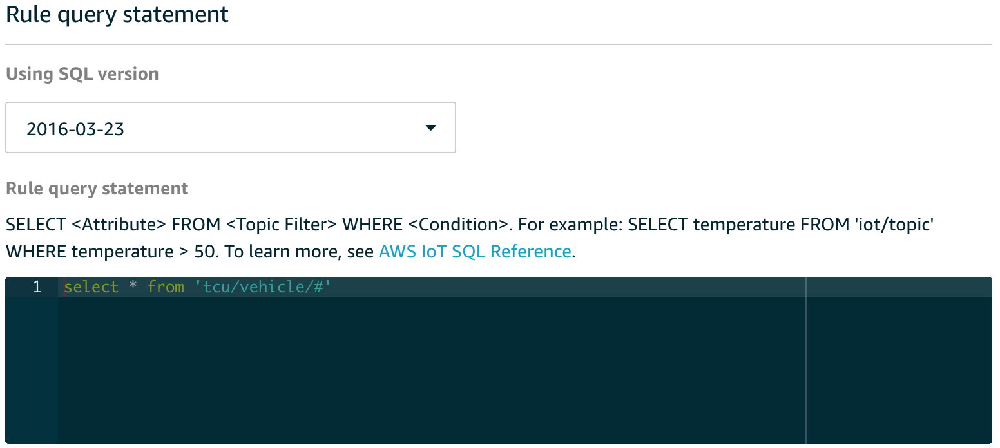

# Lab 2: Store Device Generated Data

In this lab, we will configure a rule in IoT to send data generated by
our **tcu** (name of your device) thing to a DynamoDB table.

## Step 1 – Create DynamoDB Table

Create a DynamoDB table called **tcu-speed** with Partition **trip\_id**
and Sort Key **timestamp. Datatype would be String for both.**

## Step 2 – Setup IoT Rule

Add a rule and action to our AWS IoT setup that will listen to the
tcu/vehicle topic (all VINs) and pass messages to DynamoDB.

Open the AWS IoT dashboard and click **Act** and choose **Create**.

Create a rule with the following values:

1)  Name: *tcuSpeedRule*

2)  Description: “Rule to pass messages to DynamoDB table tcu-speed”

3)  Rule query statement: SELECT \* FROM 'tcu/vehicle/\#'

Add Action: **Split message into multiple columns of a DynamoDB table
(DynamoDBv2)** and select **Configure Action**

1)  Choose the **tcu-speed** table that you created in Step 1

2)  Click on **Create** **Role** (e.g.; tcuSpeedRule) to grant AWS IoT
    permissions to perform the action (write to the tcu-speed table)

3)  Add Action
    
    **Configure action** page as shown below: Is very important to have
    **POLICY ATTACHED** as the image shows:

Click on **Create Rule**.

## Step 3 – Generate Data and Verify Result

Run the **tcu.py** script in the Cloud9 IDE. You should be able to see
data in the **tcu-speed** table. One entry is created for each
timestamp.

NEXT: [Lab 3](./Lab3.md)