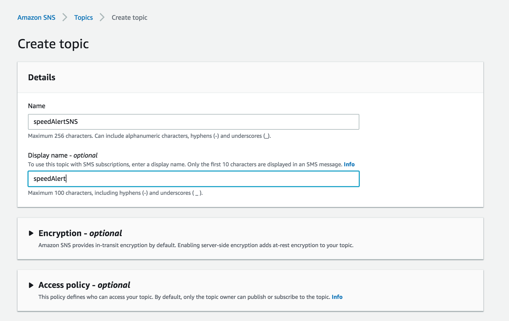
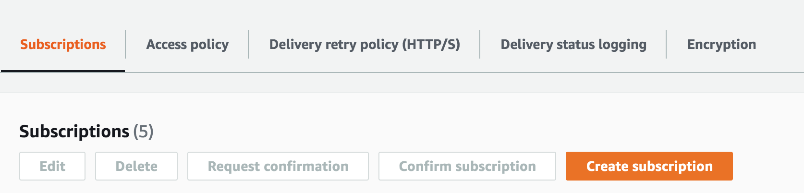
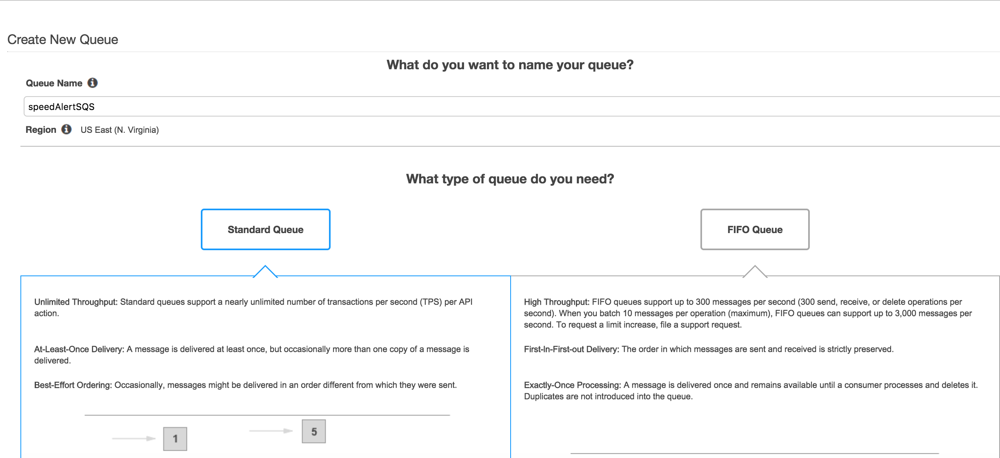
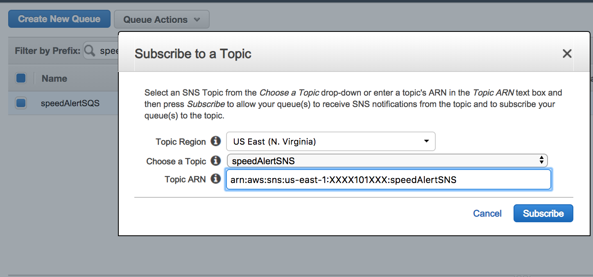
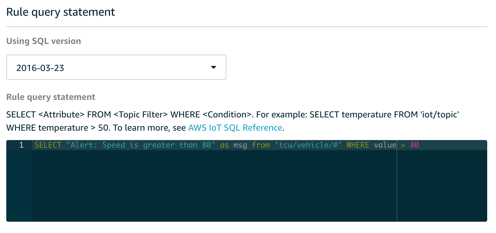
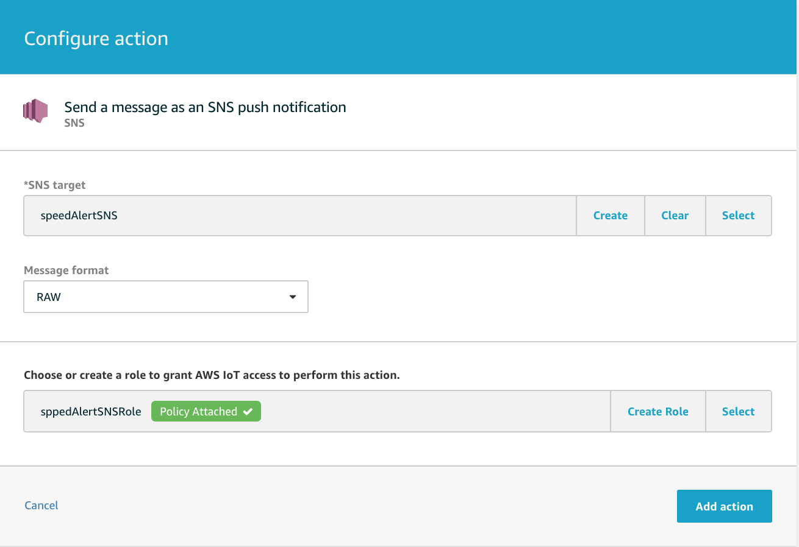
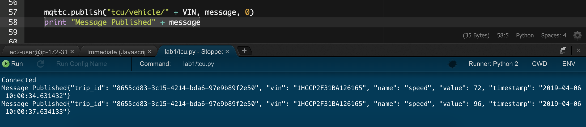
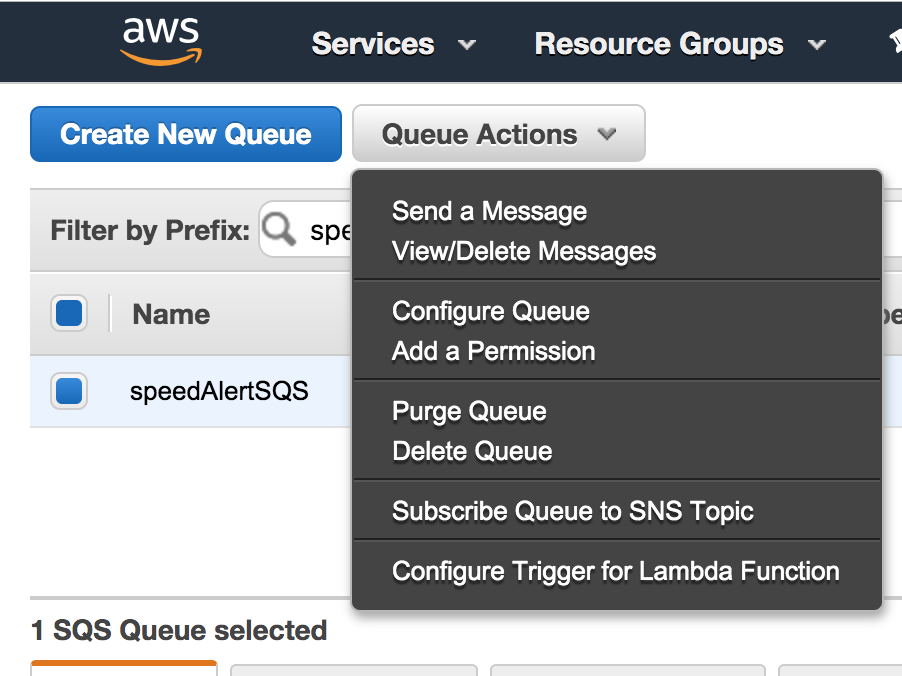
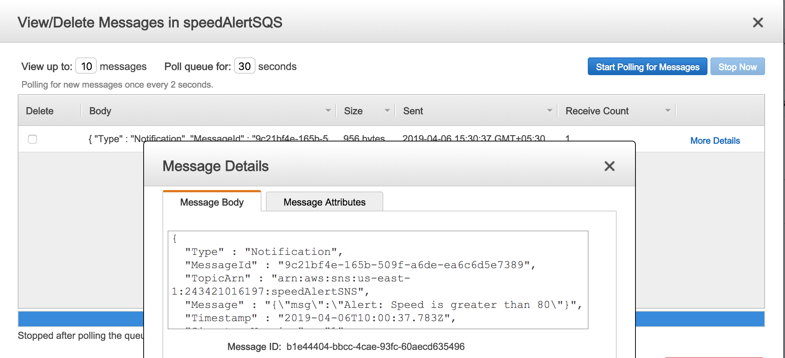

# Lab 3: Send Speed Alert in Real-Time

The Amazon Simple Notification Service (Amazon SNS) is the key to good
architecture and helps build a pluggable pattern that makes it easy to
extend your application in the future. This is critical for IoT system
design since, in many cases, you’ll want not only guaranteed message
delivery but also guaranteed actions on those messages.

For this lab we’ll setup an SNS topic, route messages from AWS IoT to
SNS, and then show how to use Amazon Simple Queue Service (Amazon SQS)
to recover messages from a failure.

## Step 1 - Create a New SNS topic

Let’s setup a new SNS topic to notify us when the tcu’s speed hits a
certain threshold.

Log into the AWS Console.

Open the SNS dashboard and create a new topic. We’ll call this topic
**speedAlertSNS**.

Make a note of the ARN for this new topic.

> 

After the topic is created, select it, and click **Create
Subscription**.  
  


On the **Create subscription** page, select the Protocol **SMS** and
Endpoint **Enter your mobile number,** and click **Create
Subscription**.

## Step 2 - Creating a new SQS queue

Let’s setup a new SQS queue so that we could recover messages in the
event of a failure/misconfiguration of the SNS service or transport. Any
messages or alerts coming into our SNS topic will also be enqueued in
the speedAlertSQS queue.

Open the SQS dashboard and create a new queue. We’ll call this queue
**speedAlertSQS**

Select **Standard Queue.**

Click **Quick-Create Queue.**

> 

Subscribe the queue to the SNS topic created earlier, **speedAlertSNS**.
Click the queue and select **Queue Actions** and click on **Subscribe
Queue to SNS topic**.



Make a note of the ARN for this new queue

At this point, any messages/alerts coming into our SNS topic also get
sent to the SQS queue.

### Step 3 - Create a New IoT Rule

Let’s test what we have so far. We’ll add a rule and action to our AWS
IoT setup that will listen to all topics and pass that message onto our
SNS topic.

Open the AWS IoT dashboard and click Act, then Create Rule.

Create a rule with the following values:

1.  Name: *speedAlertRule*

2.  Rule query statement: SQL statement shown below

> SELECT "Alert: Speed is greater than 80" as msg from "tcu/vehicle/\#"
> WHERE value \> 80

  - > 

 

Add Action: **Send a message as an SNS push notification**

1.  Choose the **speedAlertSNS** topic we created earlier

2.  Message format: **RAW**

3.  **Create Role** to grant AWS IoT permissions to perform the action
    (publish to the speedAlertSNS topic)

4.  **Add Action**
    
    **Configure action** page as shown below:

> 

Select **Create Rule**.

## Step 4 – Run the tcu and Verify Message

Before we run the tcu simulator, modify the print statement to display
the full message on the console. Stop it as soon you find speed value
greater than 80 in the cosole output.

```bash
print "Message Published" + message
```

Run the **tcu.py** script in the Cloud9 IDE. You should see something
similar to the following:



You should be receiving SMS at your configured mobile phone. If an SMS
is not received, then look in the SQS queue. Select queue
**speedAlertSQS**, choose **Queue Action,** and then **View/Delete
Messages.**



In the **View/Delete Messages** window. Click **Start Polling for
Messages**, select the message, and click **More Details**. You should
be able to see your speed alert message



You can also look in the SMS CloudWatch logs for failures. To enable
Amazon CloudWatch logs for your SMS messages, see:
<https://docs.aws.amazon.com/sns/latest/dg/sms_stats_cloudwatch.html>

## Step 5 – Optional Steps

By the end of Lab 3, a simple SMS message is sent to a mobile device.
When our TCU reaches 80mph/kmh, the speedAlertRule is configured to send
a message to SNS. As an optional step, configure the alert to show the
actual speed reached.

Participants can also configure IoT and the simulated vehicle to use a
custom endpoint. Configure this from the settings menu in AWS IoT Core.
We are using root.CA so you can remove the **-ats** from the custom
endpoint name.

NEXT: [Lab 4](./Lab4.md)