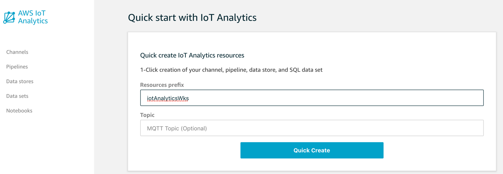
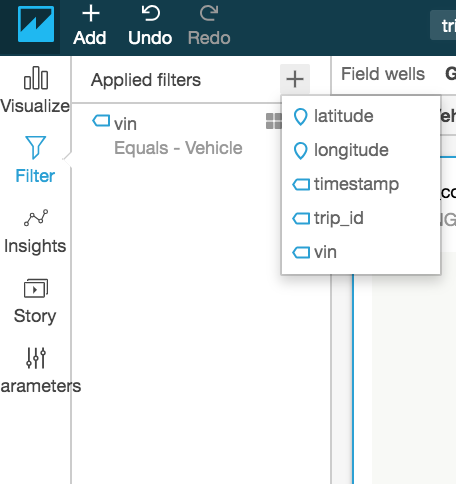
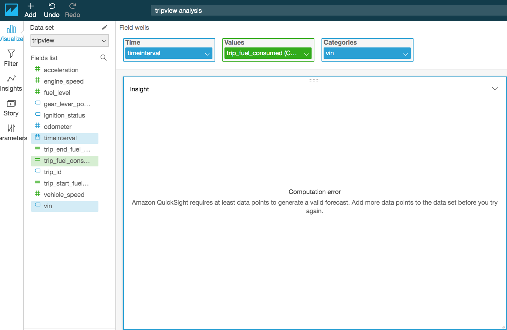

# Lab 5: Analyze Trip Data 

Lab 4 Connected Vehicle Solution and AWS IoT Simulator are prerequisites
for this lab. This lab will use the data generated by AWS IoT Simulator.
Assumes that the user has already set up an Amazon QuickSight user. If
not then refer the Setup under Step 4.

## Step 1 – Create IoT Analytics components

Open the AWS IoT Analytics console and start with **Quick start with IoT
Analytics**.



After a few second this will be finished:


Then, in AWS Console Services type : IoT Core.


In the left menu, select **Act** and then **Rules,** look for
[ConnectedVehicleTelematicsStorage](https://console.aws.amazon.com/iot/home?region=us-east-1#/rule/ConnectedVehicleTelematicsStorage)
and click: Add Action button:


Then select **Send a message to IoT Analytics** from the list and the
**Configure Action**

In the next screen select **Manually select IoT Analytics Channel and
role.** Select the channel previously created on IoT Analytics section.
And click on **Create Role**, in order to add a new one to access these
services. At the end the screen should be like:


Click on **Add rule.** Now the rule ConnectedVehicleTelematicsStorage
have two actions. When a new message arrived this will add the message
to Kinesis Firehouse and IoTAnalytics.

## Step 2 – Run Vehicle Simulation

Run 3-4 vehicles using the AWS IoT Simulator to ensure that there is
sufficient data to showcase.

Data generated by the IoT Simulator gets stored in IoT Analytics Data
Stores.

## Step 3 – Configure Data Sets

On AWS Console select IoT Analytics. And then select **Data Sets** at
the left menu. Click on the upper right button **Create** and the select
**Create SQL**


In the next screen type **queryviewdata** as an ID. Select **data store
source,** and click **Next.** As SQL query add:

```sql
SELECT vin,
trip_id,
max(CASE WHEN name = 'vehicle_speed' THEN cast(value as double) END) AS vehicle_speed,
max(CASE WHEN name = 'acceleration' THEN cast(value as double) END) AS acceleration,
max(CASE WHEN name = 'gear_lever_position' THEN value END) AS gear_lever_position,
max(CASE WHEN name = 'engine_speed' THEN cast(value as double) END) AS engine_speed,
max(CASE WHEN name = 'odometer' THEN cast(value as double) END) AS odometer,
max(CASE WHEN name = 'ignition_status' THEN value END) AS ignition_status,
max(CASE WHEN name = 'fuel_level' THEN cast(value as double) END) AS fuel_level , 
 substr(timestamp, 1, 19) AS timeInterval
FROM analyticsautotelemetry_datastore
GROUP BY trip_id, vin, substr(timestamp, 1, 19)
```

If the DataStore name is different, change it in the FROM.

Click **Test Query** to run it. Click Next and in Frecuency select
**Every 5 minutes,** again Next, and finish with **Create**

Repeat the same step but with the following SQL query:

```sql
SELECT trip_id, vin, latitude, longitude, timestamp FROM
analyticsautotelemetry_datastore where name='location'
```

And ID as TripLocation.

## Step 4 – Visualize using QuickSight

## Setup

If you are using Quicksight first time then you will get message ‘Your
AWS Account is not signed up for QuickSight. Would you like to sign up
now?’ Click on ‘Sign-up for Quicksight’

On ‘Create your Quicksight account’ page, select **Standard** and
**Continue**   

On next page, Pls ensure you have selected the right AWS region (e.g.;
us-east-1),

Provide account name (It should be unique), email id, Auto discovery and
Athena are selected by default.


Select S3, ‘Select Amazon S3 buckets’ pop-up window will open. Select
All and click Finish.


Click on Finish again. Your Quicksight account will be created. Click on
‘**Go to Amazon Quicksight’**

 

## Visualize

Open the Amazon QuickSight page and click **New Analysis** -\> **New
Data Set** -\> **Athena**. Pls ensure Quicksight has access to S3 bucket
which will be used by Athena otherwise you will get access denied error.

Enter the data source name **trip\_analysis** and click **Create data
source.**

Select the **tripview** view created in previous steps and click
**Select.**

> 

On Finish data set creation windows select **Directly query your data**
and click **Visualize**. A screen similar to the following is displayed:

> 

Let’s do some analysis on the trip data captured using the AWS IoT
Simulator.

#### Trip count by each vehicle:

Select **vin** as **X axis** and **trip\_id** as **Value**. Select
**Count distinct** for **trip\_id**, as shown below:


#### Fuel Consumed in each trip: 

Need to calculate the fuel usages by each trip. It required to create a
calculated field.

Click **Add** -\> **Add calculated field.**


Set **Calculated field name** to **trip\_start\_fuel\_level** and
formula **max({fuel\_level})** and click **Create**.


Follow the above step and create filed name **trip\_end\_fuel\_level**
and formula **min({fuel\_level})** and click **Create.**

Now we need to create a field to calculate fuel consumed by the trip as
shown below:


Add a new Analysis- Select **vin** for **X axis**,
**trip\_fuel\_consumed** as **Value** and **Group trip\_id**. Click on
the chart and a down arrow will appear. Click on down arrow and select
**Format Visual**. Change the **Y axis** label to **Fuel Consumption in
gallons**. Also change the label title to ‘**Trips**’


#### Plot Vehicle Location 

Create a new **Analysis** and **New Dataset** and select the
**tripLocation** view as the **Data source name** (follow the steps
similar to the above).

Edit the data set and Change the data type of latitude to **Latitude**
and longitude to **Longitude** (if not set automatically). Click **Save
and Visualize.**


Create a new Parameter Vehicle


Click **Set a dynamic default.** Select dataset **tripLocation,** User
name column **vin**, Default value **vin** and click **Apply.** Then
click **Create.**


Select **Filter** and click the plus sign (+) and select **vin.**



Click the **four square icon** next to filter **vin** to enable editing.


Choose a **Filter type** of **Custom filter,** select **Use
parameters,** and then click **Apply.**

Add filter parameter in Control. Click on down arrow next to Vehicle
parameter and specify the configuration as below-

 

Now click **Visualize** and select the Visual types **Points on map (it
will not visible until you have data type of longitude and latitude)**,
Drag and Drop **latitude** and **longitude** fields to Geospatial.
**Timestamp** to Size and Color **vin**. You should be able see vehicle
trip movement on the map. You might need to zoom-in or zoom-out on the
map to locate your trip.


A circular spot indicates that the vehicle was stationary at that
location for an extended period of time.

Now filter by vehicle. Select **vehicle vin** in **Controls** and click
the down arrow and select **trip\_id** for **Color**. Now you should see
trip-wise vehicle movement.


#### Create Insights (Optional Steps)

Vehicle fuel expense can be forecast using the QuickSight ML forecast,
but it requires that enough data has been generated.

Click **Add Insight** and select **Forecast.**


Refer to [Working with ML
Insights](https://docs.aws.amazon.com/quicksight/latest/user/making-data-driven-decisions-with-ml-in-quicksight.html)
in the QuickSight documentation for more information. ML Insights
requires that enough data is available to produce the output.



**  
**

NEXT: [Lab 6](./Lab6.md)
