# Lab 6: Digital Shadow

## Lab 1: Connect Device to IoT Core

Embedded source code in this document can be downloaded :

<https://smrt-parking.s3.amazonaws.com/connected_vehicle_lab_files.zip>

<https://s3.amazonaws.com/smrt-parking/demo-car.zip>

A digital shadow is the virtual representation of a physical asset. As a
vehicle becomes more connected, it triggers the need for a digital
representation of the vehicle. The digital shadow is composed of three
components: the physical entities in the real world, their virtual
models, and the connected data/view that ties those two worlds together.

In this lab, we will create digital shadow of a vehicle using AWS Device
Shadow.

## Step 1 – Create Device Shadow

We will use the existing Cloud9 IDE setup and Things created in Lab 1.
Create a file called **tcuShadowWrite.py** in the **lab1** folder and
copy the following code or use the downloaded file from pre-requisite:

```python
#!/usr/bin/python
import sys
import ssl
from AWSIoTPythonSDK.MQTTLib import AWSIoTMQTTShadowClient
import json
import time
#Setup our MQTT client and security certificates
#Make sure your certificate names match what you downloaded from AWS IoT
#Note: We are using the Shadow Client

clientId = "1HGCP2F31BA126165-write"
mqttc = AWSIoTMQTTShadowClient(clientId)
#Make sure you use the correct region!

mqttc.configureEndpoint("data.iot.us-east-1.amazonaws.com",8883)
mqttc.configureCredentials("./rootCA.pem","./tcu.private.key","./tcu.cert.pem")
shadowClient=mqttc.createShadowHandlerWithName("tcu",True)
shadowMessage = {"state" :
                {"reported":{
                    "firmware" : 'v1.01234'
                },
                "desired":{
                    "door":'close',
                    "headlight" : 'off',
                    "window" : 'up'
                }
            }
        }

shadowMessage = json.dumps(shadowMessage)

#Function to encode a payload into JSON

def json_encode(string):
        return json.dumps(string)

#Function to print message
def on_message(message, response, token):
        print " response : " + response

shadowClient.on_message= on_message
shadowClient.json_encode=json_encode

#sending first shadow update
mqttc.connect()
print "Connected"
shadowClient.shadowUpdate(shadowMessage,on_message, 5)
print "Shadow Update Sent"
time.sleep(5)
mqttc.disconnect()
```

Here we are importing AWSIoTMQTTShadowClient to connect to thing’s
shadow.

Ensure you are using the right region for your mqtt endpoint. Now make
some change in your code:

Replace this VIN number with yours.
```python
VIN = "1HGCP2F31BA126165-write"
```
Replace tcu with your device name on AWS IoT.
```python
shadowClient = mqttc.createShadowHandlerWithName("tcu", True)
```

Let’s look into the shadow message structure.

**state**

> **reported**
> 
> The reported state of the thing. Things write to this portion of the
> document to report their new state. Applications read this portion of
> the document to determine the state of a thing.
> 
> **desired**
> 
> The desired state of the thing. Applications can write to this portion
> of the document to update the state of a thing without having to
> directly connect to a thing.

```json

shadowMessage = {
        "state": {
            "reported": {
                    "door": 'close',
                    "headlight": 'off',
                    "firmware": 'v1.01234'
                    },
            "desired": {
                    "door": 'close',
                    "headlight": 'off',
                    "window": 'up'
                    }
            }
    }
```

Here we are trying to change the vehicle state: 1) close the door, 2)
turn headlight off, and 3) put the window up.

Run the **tcuShadowWrite.py** script. You should be able to see the
output as below in Cloud9 IDE console.

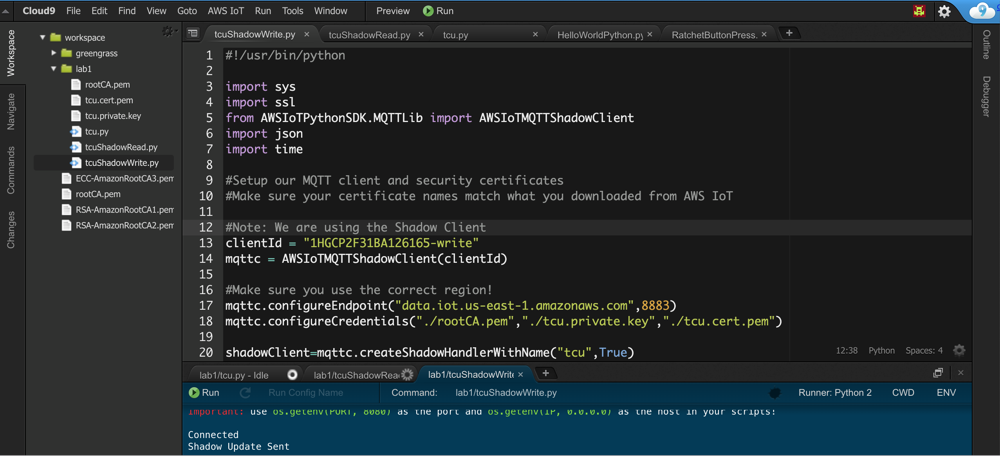

Open AWS IoT Core. Click **Manage** -\> **Things** -\> Select **tcu**,
and then choose **Shadow.** You should be able to see the shadow message
sent from the device.

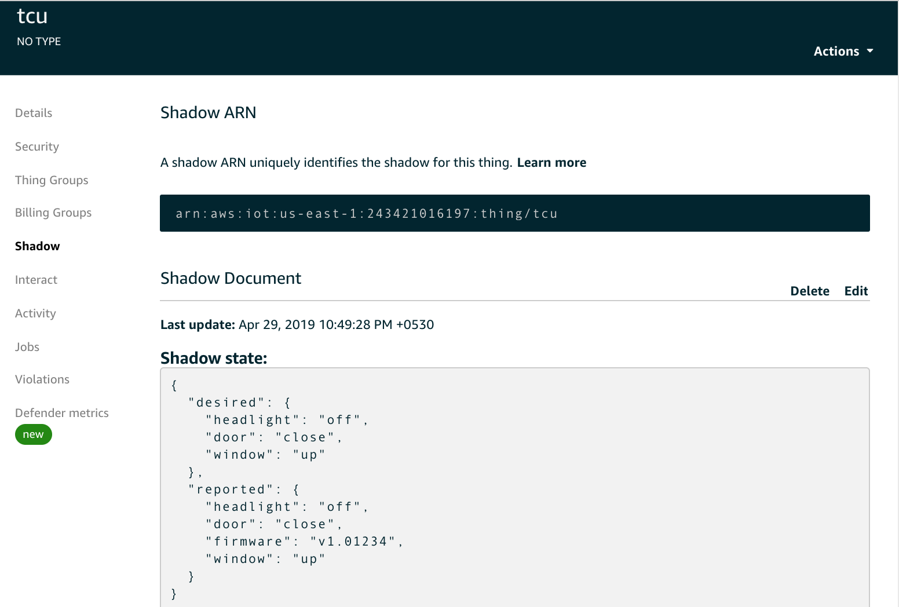

## Step 2 – Read Device Shadow

Now let’s read a shadow message at the device if it gets updated in the
cloud. Create a new python file called **tcuShadowRead.py** in the
**lab1** folder and copy the following code or use the downloaded file
from pre-requisite:

```python
#!/usr/bin/python
import sys
import ssl
from AWSIoTPythonSDK.MQTTLib import AWSIoTMQTTShadowClient
import json
import time

# Setup our MQTT client and security certificates\# Make sure your
certificate names match what you downloaded from AWS IoT

# Note: We are using the Shadow Client
clientId = "1HGCP2F31BA126165-read"
mqttc = AWSIoTMQTTShadowClient(clientId)

# Make sure you use the correct region!

mqttc.configureEndpoint("data.iot.us-east-1.amazonaws.com", 8883)
mqttc.configureCredentials("./rootCA.pem", "./tcu.private.key", "./tcu.cert.pem")

shadowClient = mqttc.createShadowHandlerWithName("tcu", True)

# Function to encode a payload into JSON

def json_encode(string):
    return json.dumps(string)

mqttc.json_encode = json_encode
shadowClient.json_encode = json_encode

def on_message(message, response, token):
    print "Received Delta : " + message
    data = json.loads(message)
    currentState = data.get('state')
    #reportedShadowMessage = {"state":{"reported":{}}}
    shadowClient.reportedShadowMessage = {"state":{"reported":{}}}
    #handle each command
    headlight_handle(currentState.get('headlight'))
    window_handle(currentState.get('window'))
    door_handle(currentState.get('door'))
    msg = json.dumps(shadowClient.reportedShadowMessage)
    #print msg
    #Update the reported status to device shadow
    shadowClient.shadowUpdate(msg,on_reported, 5)

def on_reported(message, response, token):
    print "Reported state : " + response

def headlight_handle(status):
    if status is not None:
    shadowClient.reportedShadowMessage['state']['reported']['headlight']= status
    print 'Perform action on headlight status change: ' + str(status)

def window_handle(status):
    if status is not None:
        shadowClient.reportedShadowMessage['state']['reported']['window']= status
        print 'Perform action on window status change: ' + str(status)

def door_handle(status):
    if status is not None:
        shadowClient.reportedShadowMessage['state']['reported']['door'] =status
        print 'Perform action on door status change: ' + str(status)

mqttc.on_message = on_message
shadowClient.on_message = on_message
mqttc.connect()

print "Connected"
shadowClient.shadowRegisterDeltaCallback(on_message)
print "Listening for Delta Messages"

# Loop forever

while True:
    pass
```

Replace this VIN number with yours:

```python
VIN = "1HGCP2F31BA126165-read"
```
Replace **tcu** with your **device name** in AWS IoT.
```python
shadowClient = mqttc.createShadowHandlerWithName("tcu", True)
```

Now run the **tcuShadowRead.py** file.

Open AWS IoT Core. Click **Manage** -\> **Things,** select **tcu,** and
then choose **Shadow.** Click **Edit**, change the desired state of the
headlight to on, and click **Save**.

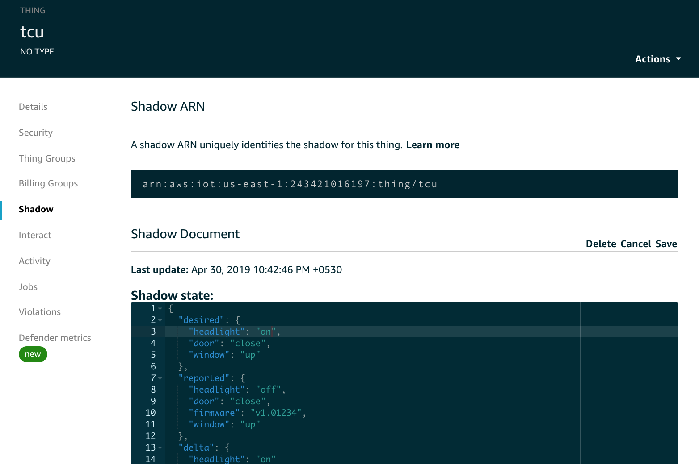

After you save, you should see the update on the Cloud9 IDE console as
shown:

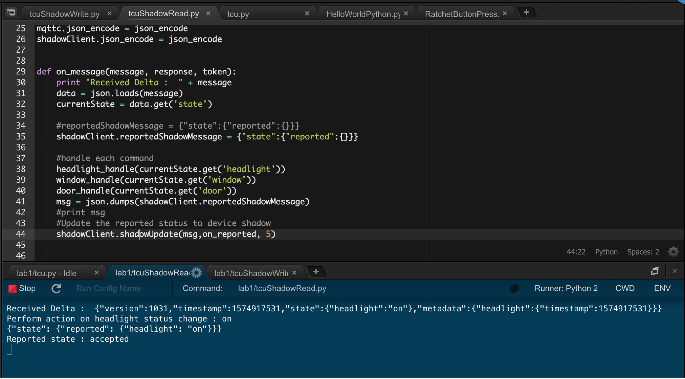

## Step 3 – Deploy virtual model of a vehicle

The three worlds of digital shadow will be represented here:

1.  Environment setup with Cloud9 IDE is acting as physical entities in
    the real world

<!-- end list -->

1.  A web page will represent the Virtual models of a vehicle

2.  And the connected data/view that ties both worlds. It is represented
    by the shadow message.

So far, we have looked into the 1) and 3) worlds as per the concept of
digital shadow. Let’s set up a virtual model.

To simply the deployment, we will reuse the IoTSimulator website to
deploy the code to represent the virtual model of a vehicle. It will
allow us to reuse the configuration and IoT SDK.

2.  Download the **demo-car.zip** file from
    <https://s3.amazonaws.com/smrt-parking/demo-car.zip>.

**Note:** The CodePen
[project](https://codepen.io/YusukeNakaya/pen/ZadZxL), with minor
changes, is used for the model.

3.  The IoTSimulator creates an Amazon CloudFront endpoint and deploys
    website code in Amazon S3. You will have an S3 bucket called:

\<*IoT simulator stack name*\>-iotsimwebsitebucket-\<*random
character*\>.us-east-1.amazonaws.com

4.  Put the Unzip folder to Cloud9 project under Workspace.

5.  Copy the content to S3 bucket:
    
    *aws s3 cp demo-car
    s3://iot-simulator-iotsimwebsitebucket-\<random\>/assets/demo-car/
    --recursive*

6.  Now open the file using the CloudFront endpoint:

https://\<*random character*\>.cloudfront.net/assets/demo-car/demo.html

You should see a page similar to the following:

> 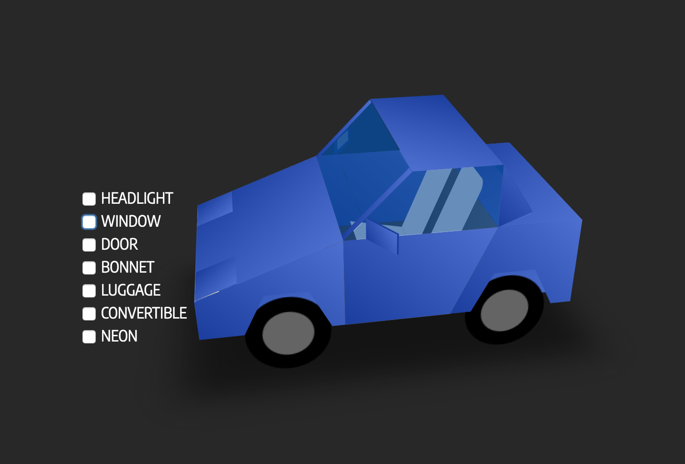

## Step 4 – Configure Virtual Model of a Vehicle

3.  Create a JavaScript file called **demo-car.js** in the demo-car
    folder and paste in the following code or use the downloaded code
    from pre-requisite. This file includes the functions that our
    simulated vehicle will use in order to change the device shadow.
    
    **Note**: JS double quote (") might convert into word double quote
    (“). Pls change.
```java
var demoCar = {
shadowMessage : {
    "state" :
        {
        "reported" :
            {
            "firmware" : 'v1.01234'
            },
        "desired":{}
        }
},

// Create a client id to use when connecting to AWS IoT.
_clientId :'1HGCP2F31BA126165-Web',
// Create the AWS IoT device object. Note that the credentials must be
// initialized with empty strings; when we successfully authenticate to
// the Cognito Identity Pool, the credentials will be dynamically updated.

webClient : new AWS.IotData({
    // Set the AWS region we will operate in.
    region: appVariables.REGION,
    ////Set the AWS IoT Host Endpoint
    endpoint:appVariables.IOT\_ENDPOINT,
    // Use the clientId created earlier.
    clientId: this.\_clientId,
    // Connect via secure WebSocket
    protocol: 'wss',
    // Set the maximum reconnect time to 8 seconds; this is a browser application
    // so we don't want to leave the user waiting too long for reconnection after
    // re-connecting to the network/re-opening their laptop/etc...
    maximumReconnectTimeMs: 8000,
    // Enable console debugging information (optional)
    debug: true,
// IMPORTANT: the AWS access key ID, secret key, and sesion token must be
// initialized with empty strings.
    accessKeyId: '',
    secretKey: '',
    sessionToken: ''
}),

//this function will get called when user will click on door checkbox
handleDoorCommand: function(obj) {
    obj.checked ? demoCar.shadowMessage.state.desired.door = "open" :
    demoCar.shadowMessage.state.desired.door = "close";
    console.log(obj.getAttribute("data-text") + " : " +
    demoCar.shadowMessage.state.desired.door);
    demoCar.accessIoTDevice();
},

//this function will get called when user will click on window checkbox
handleWindowCommand : function(obj) {
    obj.checked ? demoCar.shadowMessage.state.desired.window = "down" :
    demoCar.shadowMessage.state.desired.window = "up";
    console.log(obj.getAttribute("data-text") + " : " +
    demoCar.shadowMessage.state.desired.window);    
    demoCar.accessIoTDevice();
},

//this function will get called when user will click on headlight checkbox
handleHeadLightCommand : function(obj) {
    obj.checked ? demoCar.shadowMessage.state.desired.headlight = "on" :
    demoCar.shadowMessage.state.desired.headlight = "off";
    console.log(obj.getAttribute("data-text") + " : " +
    demoCar.shadowMessage.state.desired.headlight);
    demoCar.accessIoTDevice();
},

// Called to use UnAuth role to access IoT service

accessIoTDevice: function() {   
    //Create Identity credentials
    AWS.config.region = appVariables.REGION;
    AWS.config.credentials = new AWS.CognitoIdentityCredentials( {IdentityPoolId : appVariables.IDENTITY_POOL_ID});
    // Obtain AWS credentials
    AWS.config.credentials.get(function () {

//Connect the IoT using this credentials
//demoCar.connectDevice(AWS.config.credentials.accessKeyId,AWS.config.credentials.secretAccessKey, AWS.config.credentials.sessionToken);

demoCar.webClient.config.credentials = AWS.config.credentials;
demoCar.connectDevice();

//Connect for two way if its not connected.

if(!CONNECTED)
        {
        connectDeviceTwoWay(AWS.config.credentials);
        }
    });
},

connectDevice : function()
{
var params = {
    payload: JSON.stringify(demoCar.shadowMessage) /* Strings will be Base-64 encoded on your behalf */
    thingName: 'tcu' /* required */
};

demoCar.webClient.updateThingShadow(params, function(err, data) {
    if (err) console.log(err, err.stack); // an error occurred
    else console.log(data);
    // successful response
    //reset the local shadow state
    demoCar.shadowMessage.state.desired = {}
    });
  },
}
```
7.  Let’s look at the code:

<!-- end list -->

1.  In **shadowMessage**, desired state is empty. It will be set during
    runtime.

2.  **_CliendId** should be unique so put your VIN number below

3.  We have 3 handle command function defined (e.g., handleDoorCommand)
    to take the user input and access AWS IoT Core services. Here we are
    using the Cognito UnAuth role to access IoTCore.

4.  **connectDevice** is an actual function to invoke
    **updateThingsShadow** function to send the desired state

<!-- end list -->

8.  Edit **demo.html** file and add the following script under \<head\>.
    We are reusing the SDK and **appVariables.js** file of the IoT
    Simulator.

```html
<!--add below scripts to access AWS IoT services and application logic-->
 <script src="../aws-sdk.min.js"></script>
 <script src="../aws-iot/aws-iot.js"></script>
 <script src="../appVariables.js"></script>
 <script src="demo-car.js"></script>
```

9.  Add **onclick** handlers for **headlight**, **window**, and **door**
    to invoke the appropriate function, such as
    demoCar.handleHeadLightCommand(this) for **headlight**, as shown
    below:

```html
<input class="action headlight" type="checkbox" data-text="HEADLIGHT" onclick='demoCar.handleHeadLightCommand(this);'/>
<input class="action window" type="checkbox" data-text="WINDOW" onclick='demoCar.handleWindowCommand(this);'/>
<input class="action door" type="checkbox" data-text="DOOR" onclick='demoCar.handleDoorCommand(this);'/>
```

10. Now let’s allow UnAuth role to access IoT services.

11. Open Cognito \> Manage Identity Pools \>
    IoT\_Device\_Simulator\_Pool \> Edit identity pool
    
    On **Unauthenticated identities** section, click on the small
    triangle and then
    
    enable “Enable access to unauthenticated identities” checked and
    click on ‘**Create new role**’ for Unauthenticated role.
    
    Screen should be like this:
    
    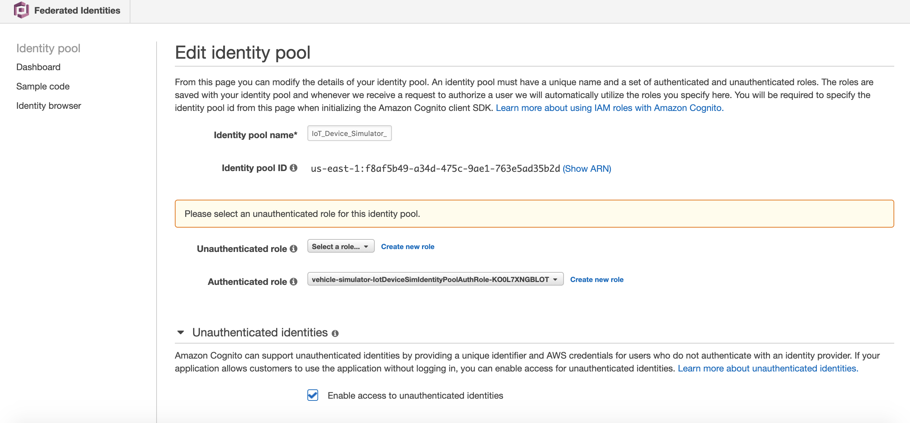
    
    When you click **create new role** this screen will show:
    
    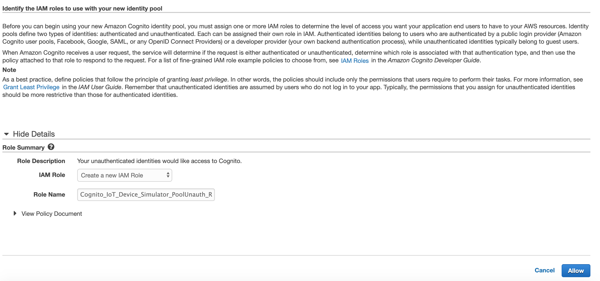
    
    Click on Allow

12. Go into IAM role and search for UnAuth you have created. You will
    find a role something like below. Open the role page.

> \<IoT simulator stack
> name\>-IotDeviceSimIdentityPoolUnauthRole-\<XDEXXXXWKQX\>
> 
> Alternatively, you can find the exact UnAuth role from the Cognito
> Identity pool page. IoT Simulator creates IoT\_Device\_Simulator\_Pool
> 
> Note: To simplify the lab, we are using UnAuth role otherwise Auth
> role is recommended for proof of concept and production environments.

13. Expand the attached policy and select **Edit** Policy under the
    **Permissions** tab.

14. Add the permission for **GetThingsShadow** and
    **UpdateThingsShadow.** This policy will allow the following
    actions:
```json
"Action": [
     "iot:Receive",
    "iot:Subscribe",
    "iot:Connect", 
    "iot:GetThingShadow",
    "iot:UpdateThingShadow"
    ]
```

The full policy will be:
```json
{
    "Version": "2012-10-17",
    "Statement": [
        {
            "Effect": "Allow",
            "Action": [
                "mobileanalytics:PutEvents",
                "cognito-sync:*",
                "iot:Receive",
                "iot:Subscribe",
                "iot:Connect",
                "iot:GetThingShadow",
                "iot:UpdateThingShadow"
            ],
            "Resource": [
                "*"
            ]
        }
    ]
}
```

Now the UnAuth role has sufficient permissions to connect to IoTCore and
send / receive Things shadow.

## Step 5 – Run the Vehicle

In this step, we will run the demo model of the vehicle and execute the
code at **tcu**. State change of the vehicle model should be reached to
**tcu** to act on the message.

4.  Now let’s open the **demo.html** using the CloudFront URL of the
    simulator website (deployed earlier)
    <https://xxxxxxxx.cloudfront.net/assets/demo-car/demo.html>

<!-- end list -->

15. Delete the existing shadow message to ensure current and previous
    state is not affecting the output. Click **IoT Core** -\> **Manage**
    -\> **Things** -\> **tcu** -\> **Shadow** -\> **Delete.**

> 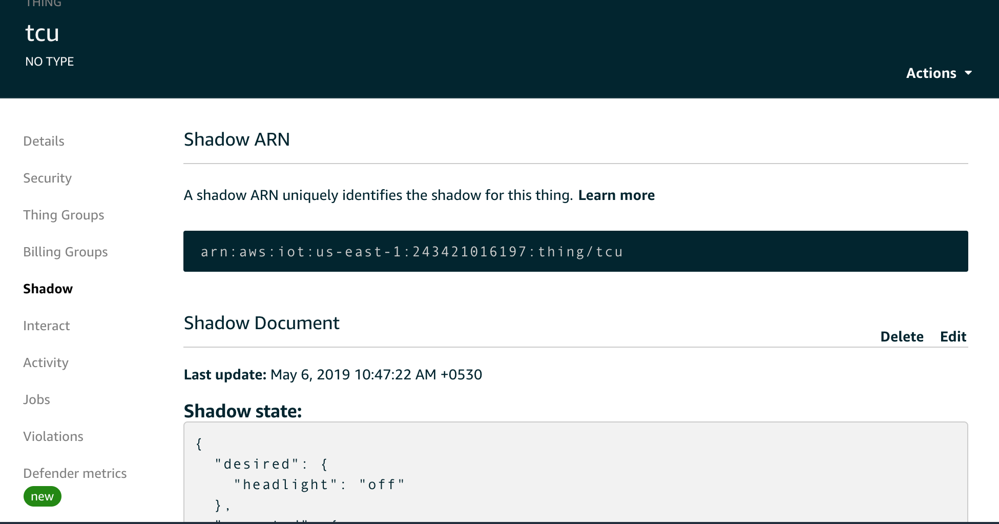

16. Run the **tcuShadowReady.py** script in Cloud9 IDE.

**shadowRegisterDeltaCallback** will listen on delta topics for this
device shadow by subscribing to delta topics. Callback will be fired
whenever there is a difference between the desired and reported state.

17. 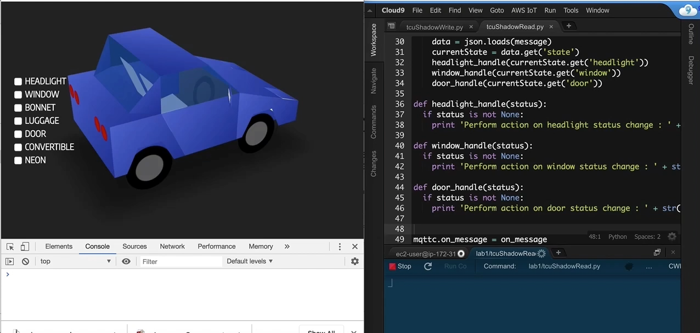Now change the headlight on the demo car
    virtual model. Keep the Cloud9 IDE and **demo.html** side by side.
    You should be able to view the change as shown below:

## Step 6 – Configure Two-Way Communication

AWS IoT supports websockets over mqtt. Currently the JavaScript SDK
doesn’t support websocket. Therefore, we will use an open source Eclipse
Paho script to make it happen.

Create a new JavaScript file named **webSocketApp.js** and paste in the
code shown or use the downloaded code from pre-requisite:

```java
var CONNECTED = false;   
/**
   * utilities to do sigv4
   * @class SigV4Utils
   */
function SigV4Utils() {}

SigV4Utils.getSignatureKey = function (key, date, region, service) {
    var kDate = AWS.util.crypto.hmac('AWS4' + key, date, 'buffer');
    var kRegion = AWS.util.crypto.hmac(kDate, region, 'buffer');
    var kService = AWS.util.crypto.hmac(kRegion, service, 'buffer');
    var kCredentials = AWS.util.crypto.hmac(kService, 'aws4_request', 'buffer');    
    return kCredentials;
};

SigV4Utils.getSignedUrl = function(host, region, credentials) {
    var datetime = AWS.util.date.iso8601(new Date()).replace(/[:\-]|\.\d{3}/g, '');
    var date = datetime.substr(0, 8);

    var method = 'GET';
    var protocol = 'wss';
    var uri = '/mqtt';
    var service = 'iotdevicegateway';
    var algorithm = 'AWS4-HMAC-SHA256';

    var credentialScope = date + '/' + region + '/' + service + '/' + 'aws4_request';
    var canonicalQuerystring = 'X-Amz-Algorithm=' + algorithm;
    canonicalQuerystring += '&X-Amz-Credential=' + encodeURIComponent(credentials.accessKeyId + '/' + credentialScope);
    canonicalQuerystring += '&X-Amz-Date=' + datetime;
    canonicalQuerystring += '&X-Amz-SignedHeaders=host';

    var canonicalHeaders = 'host:' + host + '\n';
    var payloadHash = AWS.util.crypto.sha256('', 'hex')
    var canonicalRequest = method + '\n' + uri + '\n' + canonicalQuerystring + '\n' + canonicalHeaders + '\nhost\n' + payloadHash;

    var stringToSign = algorithm + '\n' + datetime + '\n' + credentialScope + '\n' + AWS.util.crypto.sha256(canonicalRequest, 'hex');
    var signingKey = SigV4Utils.getSignatureKey(credentials.secretAccessKey, date, region, service);
    var signature = AWS.util.crypto.hmac(signingKey, stringToSign, 'hex');

    canonicalQuerystring += '&X-Amz-Signature=' + signature;
    if (credentials.sessionToken) {
        canonicalQuerystring += '&X-Amz-Security-Token=' + encodeURIComponent(credentials.sessionToken);
    }

    var requestUrl = protocol + '://' + host + uri + '?' + canonicalQuerystring;
    console.log(requestUrl);
    return requestUrl;
};

var connectOptions = {
    
    onSuccess: function(){
        console.log("onSuccess called") 
        onConnect();
    },
    useSSL: true,
    timeout: 3,
    mqttVersion: 4,
    
    onFailure: function() {
        console.log("onFailure called") 
    }
};

var client;

function connectDeviceTwoWay(credentials)
{
    //get the url
    requestUrl = SigV4Utils.getSignedUrl (appVariables.IOT_ENDPOINT, appVariables.REGION, credentials)
    clientId  = "1HGCP2F31BA126165-WebTwoWay"
    
    // Create a client instance
    client = new Paho.MQTT.Client(requestUrl, clientId);

    // set callback handlers
    client.onConnectionLost = onConnectionLost;
    client.onMessageArrived = onMessageArrived;

    // connect the client
    client.connect(connectOptions);
}

// called when the client connects
function onConnect() {
  // Once a connection has been made, make a subscription and send a message.
  console.log("onConnect");
  CONNECTED = true;
  client.subscribe("$aws/things/tcu/shadow/update/accepted");
}

// called when the client loses its connection
function onConnectionLost(responseObject) {
    CONNECTED = false;
    if (responseObject.errorCode !== 0) {
    console.log("onConnectionLost:" + responseObject.errorMessage);
  }
}

// called when a message arrives
function onMessageArrived(message) {
  CONNECTED = true;
  console.log("onMessageArrived:" + message.payloadString);
  payload = JSON.parse(message.payloadString);
  payloadData = payload.state.reported == undefined ? payload.state : payload.state.reported
  payloadData = payloadData.desired == undefined ? payload.state : payload.state.desired
  
  if (payloadData.window != undefined) handleWindowCommand(payloadData.window);
  if (payloadData.door != undefined) handleDoorCommand(payloadData.door);
  if (payloadData.headlight != undefined) handleHeadlightCommand(payloadData.headlight);
}

//this function will get called when user will click on window checkbox
function handleWindowCommand (windowStatus) {
  obj = document.getElementsByClassName("action window")[0];
  obj.checked = windowStatus ==   "down" ? true : false;
  console.log(obj.getAttribute("data-text") + " : " + obj.checked);  
}

//this function will get called when user will click on door checkbox
function handleDoorCommand (doorStatus) {
  obj = document.getElementsByClassName("action door")[0];
  obj.checked = doorStatus ==   "open" ? true : false;
  console.log(obj.getAttribute("data-text") + " : " + obj.checked);  
}

//this function will get called when user will click on Headlight checkbox
function handleHeadlightCommand (headlightStatus) {
  obj = document.getElementsByClassName("action headlight")[0];
   obj.checked = headlightStatus ==   "on" ? true : false;
  console.log(obj.getAttribute("data-text") + " : " + obj.checked);  
}
```


> Let’s look at the code:

  - **SigV4Utils.getSignatureKey** and **SigV4Utils.getSignedUrl** are
    utility functions used in generating a Signature Version 4 request.
    The WebSocket implementation provided by most web browsers does not
    allow the modification of HTTP headers, so it is necessary to add
    the Signature Version 4 information to the query string.

  - Update the **ClientId** with VIN in the **connectDeviceTwoWay**
    function to ensure it is unique.

  - > **onConnect()** function subscribes to IoT Core topics
    > “aws/things/\<*thingName*\>/shadow/update/accepted". In this
    > lab, *thingName* is **tcu**. We are subscribing to the shadow
    > update accepted. The Device Shadow service sends messages to this
    > topic when an update is successfully made to the device's shadow.

  - **onMessageArrived()** function will be invoked whenever the device
    will change the shadow state.

  - **handle\<*object*\>Command** functions (such as
    **handleDoorCommand**) will be called with the current state.

<!-- end list -->

5.  Open a **demo.html page** to add Eclipse Paho script copy the below
    code and paste under the \<head\> tag:

```html
<!--Added Eclipse Paho script for WebScoket MQTT--> 
      <script src="https://cdnjs.cloudflare.com/ajax/libs/paho-mqtt/1.0.1/mqttws31.js" type="text/javascript"></script>

```

18. Open the **demo-car.js** file and uncomment the following code:
```java
//Connect for two way if its not connected.
      if(!CONNECTED)
       {
         connectDeviceTwoWay(AWS.config.credentials);
       }

```
19. Now add the **webSocketApp.js** script in the **demo.html** file
    before **demo-car.js**:
```html
<script src="webSocketApp.js"></script> 
<script src="demo-car.js"></script>
```

20. The c**onnectDeviceTwoWay** function in **webSocketApp.js** gets
    called for the first time to establish the mqtt connect over
    websocket. After establishing the connection, CONNECTED is always
    true. You can also establish the connection during page load with
    \<body onload="demoCar.accessIoTDevice();"\> in the **demo.html**

21. 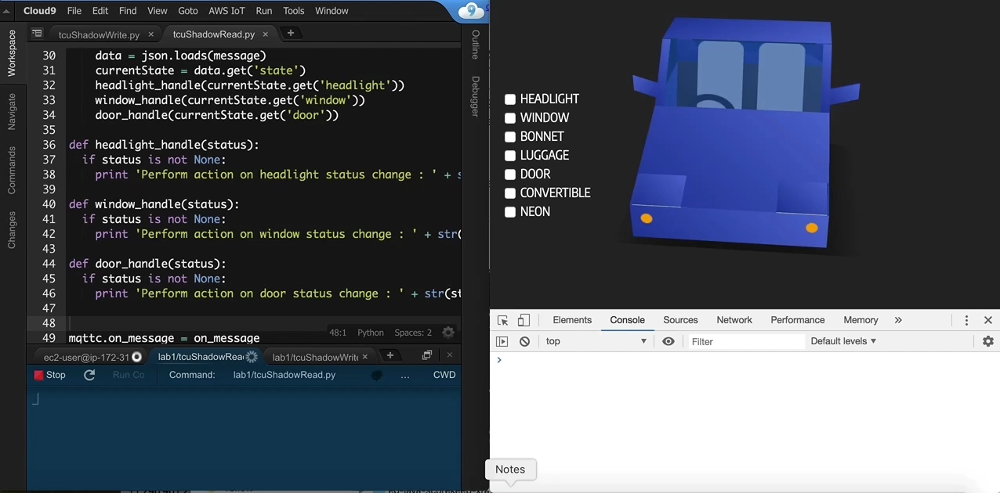Now keep both Cloud9 IDE and
    **demo.html** side by side and run the **tcuShadowRead.py** script.

22. Open the **tcuShadowWrite.py** file and change the desired state of
    door to open, headlight to on, and window to up and click **Save.**

```json
"desired":{
            "door":'open',
            "headlight" : 'on',
            "window" : 'up'
        }  

```

23. Click **Run** to execute the **tcuShadowWrite.py** script. You
    should be able to see the update on the **demo.html** page.

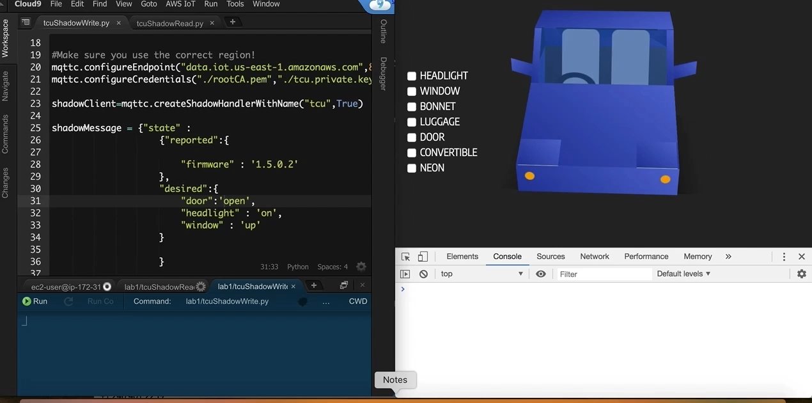

## Step 7 – Optional Steps

Follow the above steps and make the vehicle model respond to the
Convertible, Neon, Luggage, and Bonnet actions.

## Step 8 – Debug

If you are unable to see any updates on the **demo.html** page,
subscribe to the shadow document in AWS IoT test.

$aws/things/\<thingName\>/shadow/update/documents

This document will help you understand the message exchange.

Two-way communication gets established in the first invocation of the
command. Therefore, always click the checkbox and get the
**tcuShadowRead.py** working before executing **tcuShadowWrite.py**
code.

# Notices

Customers are responsible for making their own independent assessment of
the information in this document. This document: (a) is for
informational purposes only, (b) represents current AWS product
offerings and practices, which are subject to change without notice, and
(c) does not create any commitments or assurances from AWS and its
affiliates, suppliers or licensors. AWS products or services are
provided “as is” without warranties, representations, or conditions of
any kind, whether express or implied. The responsibilities and
liabilities of AWS to its customers are controlled by AWS agreements,
and this document is not part of, nor does it modify, any agreement
between AWS and its customers.

© 2019 Amazon Web Services, Inc. or its affiliates. All rights reserved.
